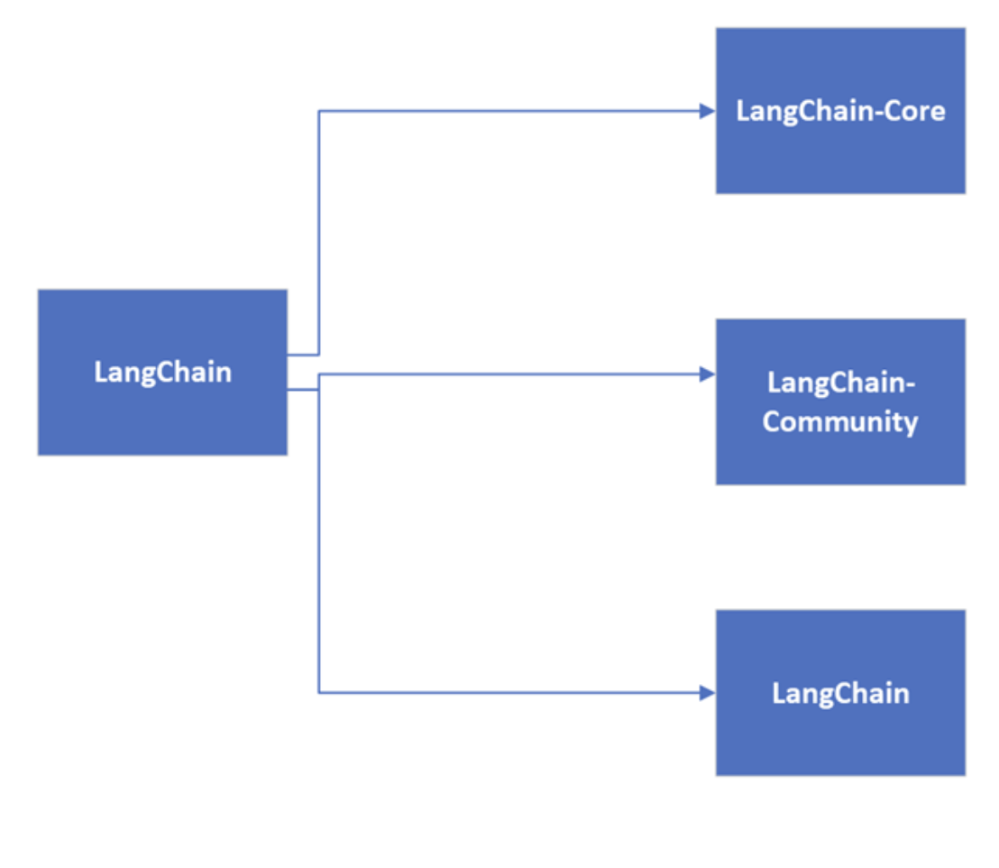
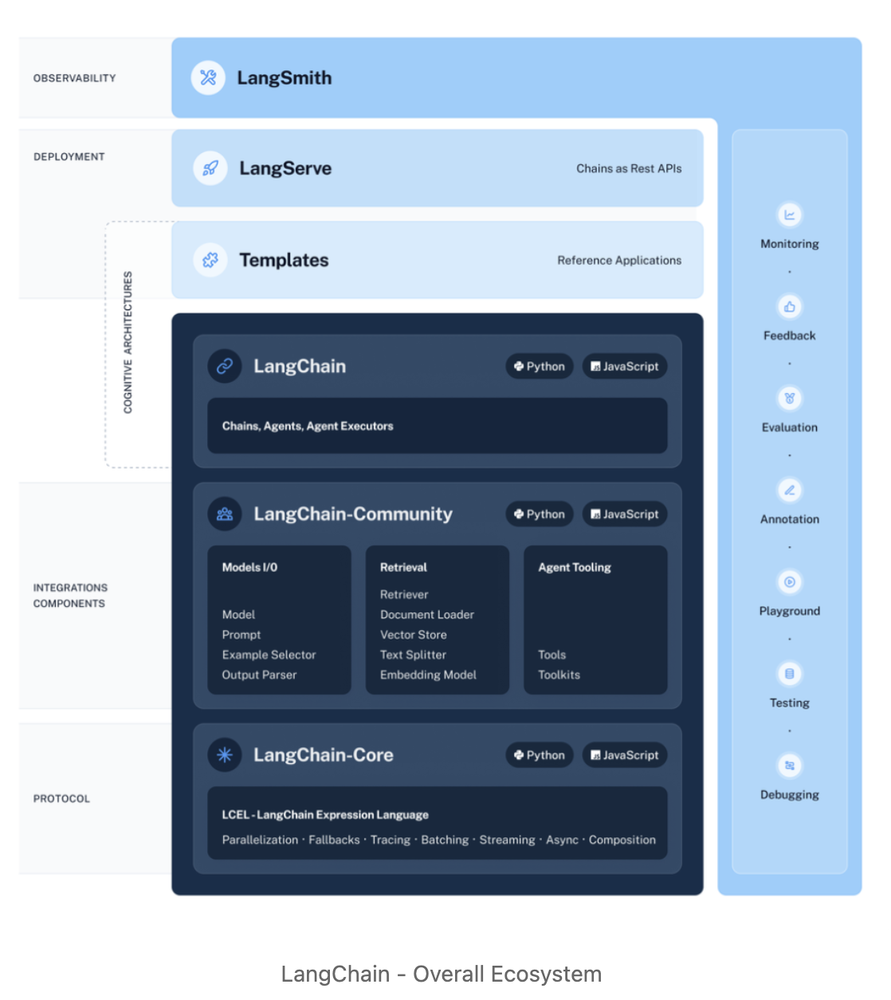

# deploy-llm-with-langchain-fastapi-starter-kit
This repository provides a starter kit for deploying Large Language Models (LLMs) using LangChain and FastAPI. It includes essential components to help you quickly set up and run LLM applications.

## Features
- Easy integration with LangChain and FastAPI
- Support for various LLMs
- Streamlined deployment process

## Requirements
- Python 3.8+
- FastAPI
- Uvicorn
- LangChain
- Streamlit
- LangServe
- python-dotenv

# Langchain Ecosystem
Langchain is a powerful framework for building applications powered by language models. It provides a wide range of components and integrations to help developers create robust LLM applications. Here are some key components in the Langchain ecosystem:

## Key Components
- LangChain - The core framework for building LLM applications.
- LangChain-Core - The core components of LangChain.
- LangChain-Community - A collection of community-contributed components for LangChain.
- LangGraph - A graph-based framework for building LLM applications.
- LangServe - A framework for serving LLM applications.
- LangSmith - A tool for monitoring and debugging LLM applications.
- LangChainHub - A repository for LangChain components and integrations.
- LangChainHub-CLI - A command-line interface for interacting with LangChainHub.
- LangChain-OpenAI - A collection of components for integrating OpenAI models with LangChain.
- LangChain-OpenAI-Chat - A collection of components for integrating OpenAI chat models with LangChain.
- LangChain-OpenAI-Embeddings - A collection of components for integrating OpenAI embeddings with LangChain.
- LangChain-OpenAI-Functions - A collection of components for integrating OpenAI functions with LangChain.
- LangChain-OpenAI-Tools - A collection of components for integrating OpenAI tools with LangChain.
- LangChain-OpenAI-VectorStore - A collection of components for integrating OpenAI vector stores with LangChain.
- LangChain-OpenAI-VectorStore-Chat - A collection of components for integrating OpenAI vector stores with LangChain chat models.
- LangChain-OpenAI-VectorStore-Embeddings - A collection of components for integrating OpenAI vector stores with LangChain embeddings.
- LangChain-OpenAI-VectorStore-Functions - A collection of components for integrating OpenAI vector stores with LangChain functions.
- LangChain-OpenAI-VectorStore-Tools - A collection of components for integrating OpenAI vector stores with LangChain tools.
- LangChain-OpenAI-VectorStore-Chat-Embeddings - A collection of components for integrating OpenAI vector stores with LangChain chat embeddings.
- LangChain-OpenAI-VectorStore-Chat-Functions - A collection of components for integrating OpenAI vector stores with LangChain chat functions.
- LangChain-OpenAI-VectorStore-Chat-Tools - A collection of components for integrating OpenAI vector stores with LangChain chat tools.

# Documentation
For more information on how to use LangChain and its components, refer to the [LangChain documentation](https://langchain.com/docs/).

# License
This project is licensed under the MIT License. See the [LICENSE](LICENSE) file for details

# Contributing
We welcome contributions to this project! If you have suggestions or improvements, please open an issue or submit a pull request. For more details, see the [CONTRIBUTING](CONTRIBUTING.md) file.